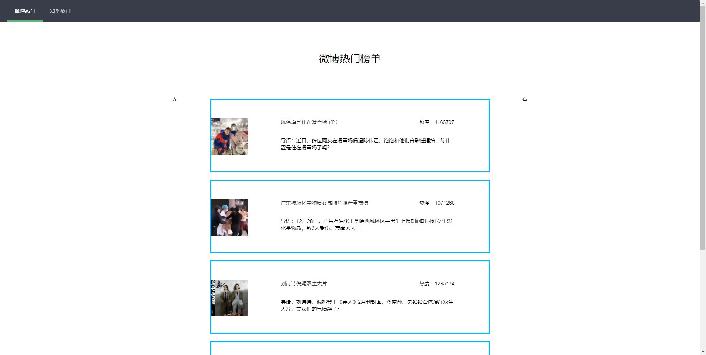

# 热门实事榜单爬虫服务

### 0.写在前面
  服务基于：
  - spring-boot 2.3.3.RELEASE 
  - spring-cloud-starter-alibaba 2.2.1.RELEASE
  - spring-cloud-starter-stream-rabbit 3.0.6.RELEASE
  
  需要预装nacos作为注册中心
### 1.简介
- news : 数据交换
  1. 通过WS的方式，向前端推送数据
  2. 支持多种前端方式，只需解析WS收到的数据即可
  - [√] HTML页面
  - [√] 微信小程序的方式
  - [-] ...
- news-reptiles : 数据获取
  1. 通过页面或网站提供的接口进行爬取数据，将数据存储到Redis中，并通过MQ的方式推送给news服务进行消费。
  2. 支持多网站获取数据
  - [√] 微博
  - [√] 知乎
  - [√] 抖音
  - [√] 百度
  - [-] 淘宝
  - [-] ...
### 2.演示
 1. html
    
    
 2. 小程序
 - 全网
 
    
 - 知乎
 
    
 - 微博
 
    
